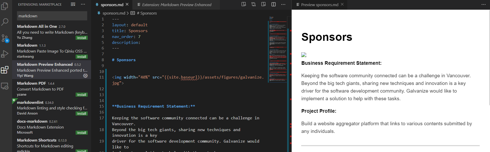

# UBC CPSC 319 - Software Engineering Project


Course web page is published using [github.io](https://ubc-cpsc319.github.io/). Any changes to the markdown files will be reflected online.

See the [Research Commons](https://ubc-library-rc.github.io/rc-workshop-template/) web page for instructions on editing the markdown files.

The site uses the [Just the Docs](https://github.com/pmarsceill/just-the-docs) Jekyll theme and the content is available under a [Creative Commons Attribution 4.0](https://creativecommons.org/licenses/by/4.0) license.

[![CC BY 4.0][cc-by-shield]][cc-by]


[cc-by]: http://creativecommons.org/licenses/by/4.0/
[cc-by-image]: https://i.creativecommons.org/l/by/4.0/88x31.png
[cc-by-shield]: https://img.shields.io/badge/License-CC%20BY%204.0-lightgrey.svg


## Instructions for updating the web page for a new term:


### Setup

Clone the repo:

`git clone ...`

Edit the repo using any markdown editor of your preference, I personally like VSCode with the `markdown preview enhanced` extension:



**Important**: during editing, figures are not displayed because their path has to comply with the Github pages syntax. 

### Editing

Each page follows a standard markdown format. A markdown cheat sheet with tips for editing is available [here](https://github.com/adam-p/markdown-here/wiki/Markdown-Cheatsheet)

Here are the files that have to be updated every term:

1. index.md 
    - Update list of TAs
    - Update URL for Canvas
1. schedule.md  
    - No need to change this file. Changes should be made on the Google spreadsheet. Any updates to the spreadsheet will be automatically reflected in the web page
1. sponsors.md 
    - Save the logo of any new sponsors under `assets/figures/`
    - Update image/logo on the `img` tag for the sponsors
        - Update business requirements and project description
1. evaluation.md
    - Update any changes to the percentages of each assignment
        - [Tips for working with markdown table](https://github.com/adam-p/markdown-here/wiki/Markdown-Cheatsheet#tables)
1. teams.md
    - Update team formation description, e.g. number of students per team


### Warnings (colored boxes)

There are 4 special boxes that you can use. 

`note` - blue box
`info` - green box
`warn` - yellow box
`danger` - red box

To display one of these boxes, follow the template:

```
Your message
{: .note}
```

Change `note` to the desired box type, e.g. To display a note in red about a change to an assignment due data:

```
The due date of the Test Plan is now **August 15th**
{: .danger}
```

### Figures

All figures should be saved under: `/assets/figures`

To correctly display a image, you have to use the following syntax:

```

```

Width is not mandatory but it's specially useful in the sponsors page.

### Deploy

1. Save your changes.
1. Add them to git `git add --all .`
1. Commit your changes `git commit -m "Message describing last changes"`
1. Push to remote `git push`
1. Github web pages will automatically deploy the web page
1. Wait a few seconds and refresh the web page to see the last changes live
1. Congrats have a cup of tea or a beer